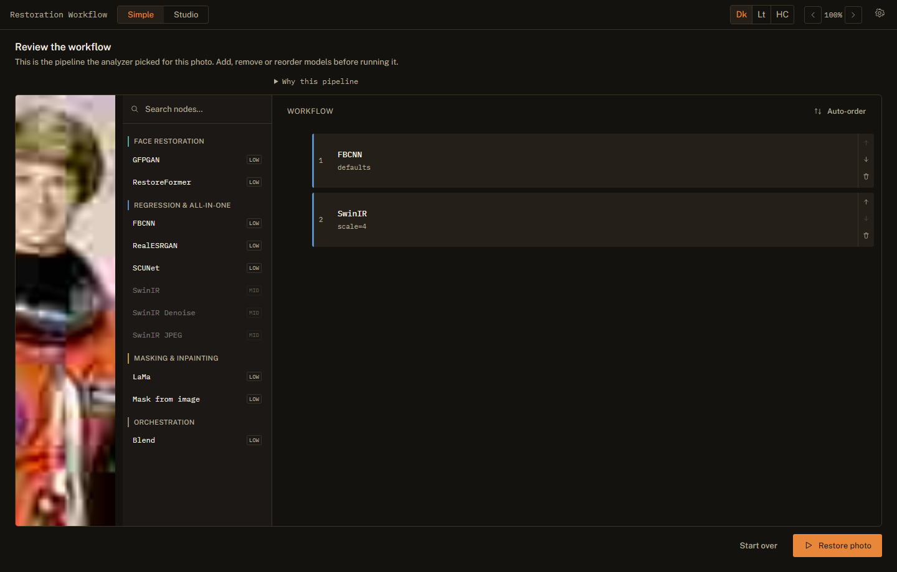
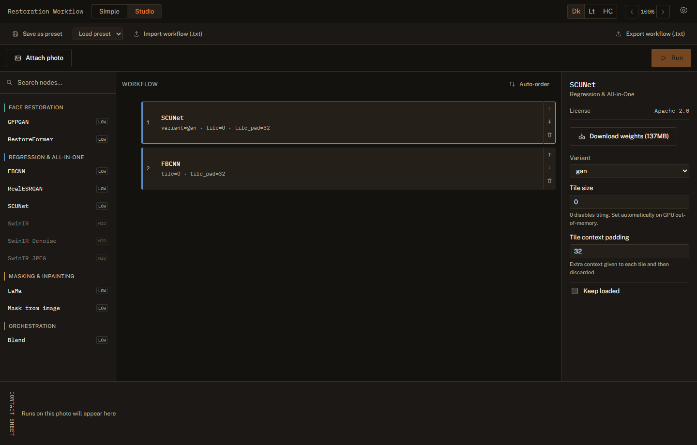
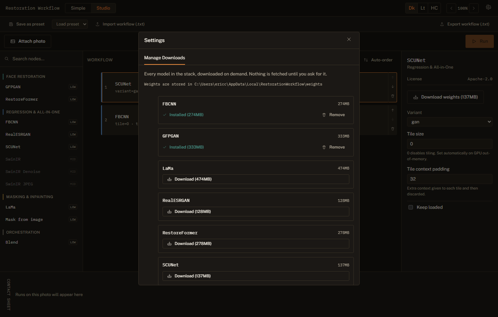

# Restoration Workflow

[](https://github.com/ericcayers-ai/Restoration-Workflow/actions/workflows/ci.yml)
[](LICENSE)
[](https://github.com/ericcayers-ai/Restoration-Workflow/releases)

Local-first photo restoration. Drop a photo and get it fixed with zero configuration, or
build a custom pipeline over an extensible model stack — both are the same engine, not
two products bolted together. No cloud, no account, no subscription; your photos never
leave your machine unless you decide to send them somewhere.

## Screenshots

| Simple Mode — customizable review | Advanced pipeline builder |
|---|---|
|  |  |

<details>
<summary>Settings → Manage Downloads</summary>


</details>

## What makes this different

- **One engine, two ways in.** Simple Mode's automatic pipeline and the Advanced builder
  submit the exact same pipeline JSON to the same executor — Simple Mode is not a
  stripped-down separate app, and nothing it does is hidden from the Advanced view.
- **An auto-order engine, not just a model list.** Every node carries a canonical
  restoration-stage rank (deblock → denoise → upscale → face → mask → inpaint →
  compose). Pick any set of models and "Auto-order" arranges them correctly — including
  auto-inserting a mask source when an inpainting node needs one.
- **A new model is a function call, not a module.** If it's one of the 40+ architectures
  [spandrel](https://github.com/chaiNNer-org/spandrel)'s `MAIN_REGISTRY` already supports,
  wrapping it is one call to `spandrel_image_node(...)` — see
  [`CONTRIBUTING.md`](CONTRIBUTING.md).
- **Workflows are `.txt` files.** Export a pipeline, read it in a text editor, hand it to
  someone else, import it back — no proprietary project format.
- **Weights are never unpickled.** Every checkpoint loads through `torch.load(...,
  weights_only=True)` or `safetensors`, with a real sha256 pinned per file — never
  `spandrel.ModelLoader.load_from_file`, which permits arbitrary pickle globals. See
  [`SECURITY.md`](SECURITY.md).
- **CPU works.** Every in-box node runs without a GPU; a CUDA GPU makes it faster, it
  doesn't gate functionality.

## The model stack (out of the box)

| Model | Role | License |
|---|---|---|
| FBCNN | JPEG artifact removal | Apache-2.0 |
| SCUNet | Blind real-world denoising | Apache-2.0 |
| SwinIR | Transformer super-resolution, denoise, JPEG removal (3 nodes) | Apache-2.0 |
| RealESRGAN | Fast general super-resolution | BSD-3-Clause |
| GFPGAN | Fast face restoration | Apache-2.0 |
| RestoreFormer | Quality face restoration | Apache-2.0 |
| LaMa | Large-mask inpainting / object removal | Apache-2.0 |

All permissive; the default automatic pipeline is validated at startup to never depend
on anything else. Full research notes, license tiers, and what was *considered but not
shipped* (and why) are in [`docs/MODEL_STACK.md`](docs/MODEL_STACK.md).

## Install

### Windows: prebuilt app

Download **`RestorationWorkflow-windows.zip`** from the
[Releases page](../../releases), extract it, and run `RestorationWorkflow.exe`. It
starts the local server and opens the app in your browser. No Python install required.
A GPU is optional — the app runs on CPU, just slower; nothing downloads until you ask
for a model.

### From source

Requirements: Python 3.10+, Node 18+. A CUDA GPU speeds up inference but is optional —
every node in the box also runs on CPU.

```bash
git clone https://github.com/ericcayers-ai/Restoration-Workflow.git
cd Restoration-Workflow/backend
pip install -e ".[inference]"

cd ../frontend
npm install && npm run build

cd ../backend
restore serve
```

`restore serve` prints the URL it's listening on (`http://127.0.0.1:8765` by default)
and serves the built frontend from that same address — open it in a browser. Model
weights are fetched on demand from Settings → Manage Downloads, or automatically the
first time Simple Mode needs one; nothing downloads at install time.

Prefer a terminal? The same engine is a CLI: `restore run -i photo.jpg -o out/`,
`restore nodes`, `restore weights list` — run `restore --help` for the rest.

## Documentation

- [`ROADMAP.md`](ROADMAP.md) — the build plan and the vision this project executes against
- [`docs/ARCHITECTURE.md`](docs/ARCHITECTURE.md) — engine, API, plugin contract, packaging
- [`docs/UI_DESIGN.md`](docs/UI_DESIGN.md) — visual identity, layout, accessibility rules
- [`docs/MODEL_STACK.md`](docs/MODEL_STACK.md) — every model considered, fact-checked and licensed
- [`CHANGELOG.md`](CHANGELOG.md) — what shipped, by version
- [`CONTRIBUTING.md`](CONTRIBUTING.md) — dev setup, adding a model, PR expectations
- [`SECURITY.md`](SECURITY.md) — vulnerability reporting, and what the engine already guards against

## Contributing

Issues and PRs are welcome — see [`CONTRIBUTING.md`](CONTRIBUTING.md) for dev setup and
[`CODE_OF_CONDUCT.md`](CODE_OF_CONDUCT.md) for community expectations. Adding a new model
is usually the smallest kind of change this codebase supports; see CONTRIBUTING's walk-through.

## License

Core orchestration (this repository): **Apache 2.0** — see [`LICENSE`](LICENSE).
Individual model weights retain their own upstream licenses; see
[`docs/MODEL_STACK.md`](docs/MODEL_STACK.md) for the license of each.
